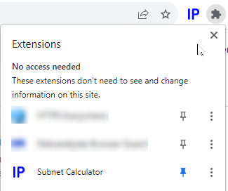
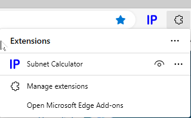
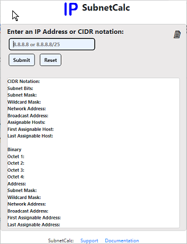
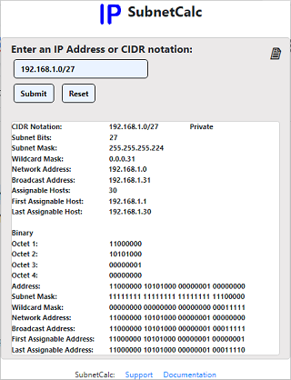

## **Subnet Calculator**

#### **Video Demo (https://youtu.be/2JqRiadxCvU)**

#### **Description**

For my final CS50 project, I created a browser **Subnet Calculator** extension that provides basic network/subnet information. This information is routinely used by IT professionals like network engineers, administrators, and penetration testers. While there are websites and mobile device apps that provide the same information, while performing the task at hand, the user must either open a new tab and navigate to the appropriate webpage or open an app on their mobile device. I have been inconvenienced many times by having had to rely on webpages and/or my mobile device app in order to retrieve needed information. I felt that a simple, convenient browser extension would be a perfect solution!  
This browser extension accepts either an IPv4 address or a CIDR notation as user input and, after validation, makes an API call (https://networkcalc.com/api)  to retrieve the desired information, which is then displayed within the display window. The user has the ability to  copy the displayed information.

Here is a list of the displayed information.

| Network Information |
| --- |
| CIDR Notation |
| Subnet Bits |
| Subnet Mask |
| Wildcard Mask |
| Network Address |
| Broadcast Address |
| Assignable Hosts |
| First Assignable Host |
| Last Assignable Host |
| Binary Octet 1 |
| Binary Octet 2 |
| Binary Octet 3 |
| Binary Octet 4 |
| Binary Address |
| Binary Subnet Mask |
| Binary Wildcard Mask |
| Binary Network Address |
| Binary Broadcast Address |
| Binary First Assignable Address |
| Binary Last Assignable Address |

#### **Technologies Used**

| ||
|---|-|
|Javascript || 
|CSS || 
|HTML || 
|jQuery || 
|Python 3 (initial build) ||

#### **Installation**

Currently, the Subnet Calculator extension can only be installed from a local directory. The Subnet Calculator extension will soon be available on the Chrome Web Store and the Microsoft Edge Addon Store.

To install the Subnet Extension, save the SubnetCalc folder to your local computer.  Open a browser (Chrome, Edge, or Firefox) and click on the extension icon  in the upper right corner.  If the icon is not present, click on the three dots (  or   or   ) in the upper right corner.  

_Google Chrome_

1.  Click on **Extensions** and when a new window opens, click on **Manage Extensions**.
2.  Make sure that the **Developer mode** switch in the upper right corner is turned on.
3.  Click on **Load unpacked** .
4.  Navigate to the location that you saved the SubnetCalc folder and select it.
5.  Click **Select Folder**.
6.  The Subnet Calculator extension has now been added to your browser.
7.  Click the Extension icon in the upper right hand corner and click on the thumbtack icon to add the Subnet Calculator icon to your toolbar.  
     

_Microsoft Edge_

1.  Click on **Extensions** and when a new window opens, click on **Manage Extensions**.
2.  Make sure that the **Developer mode** switch in the lower left corner is turned on.
3.  Click on **Load unpacked** .
4.  Navigate to the location that you saved the SubnetCalc folder and select it.
5.  Click **Select Folder**.
6.  The Subnet Calculator extension has now been added to your browser.
7.  Click the Extension icon in the upper right hand corner and click on the eye icon to add the Subnet Calculator icon to your toolbar.

    

#### **Usage**

The Subnet Calculator provides a simple user interface with a single input.  Enter an IPv4 address or CIDR notation and press the **Submit** button.  The enter key can also be pressed to submit your input.

 &nbsp;&nbsp;&nbsp;  

Press the **copy** button  to copy the contents of the display window to the clipboard.

To clear the display window, press the **Reset** button.

#### **Features**

* Simple user interface
* Robust error checking
    - Proper IPv4 and CIDR format including presence of four octets separated by '.', leading zeros, 0 - 255, and numeric.
    - No input
    - CIDR for multicast address (user given option to continue or cancel).
* Copy button to copy contents of display window to the clipboard.

#### **Files**
| File | Description | 
| --- | --- |
| manifest.json | Required file for browser extension |
| popup.html | Main HTML page for the extension |
| popup.js | Javascript file provides functionality of the extension, performs input validation, error checking, api call, and button functionality|
| style.css | Reference file for the style in the HTML file |
| README.md | This file |
| bootstrap.bundle.min | Required file for bootstrap  |
| bootstrap.min.css.map | Required file for bootstrap  |
| bootstrap.bundle.min.js | Required file for bootstrap |
| bootstrap.bundle.min.js.map | Required file for bootstrap |
| jquery-3.7.0.min.js | Required file for bootstrap  |
| jquery-3.7.0.min.js map | Required file for bootstrap |

#### **Design History**

I initially wrote the extension in Python 3 and used the ipaddress library instead of making an api call.  I was more comfortable with python than javascript. I soon realized that it is difficult to use python on a client-side extension.  After some research, I attempted to use PyScript and Brython to create the extension using python.  Both proved to be less than ideal.  Having gained confidence from CS50 in learning and applying new coding methodologies, I decided to use javascript, css, and html for the extension.

Since I had coded the extension in python, I started the new build by using a python to javascript converter (https://www.codeconvert.ai/python-to-javascript-converter) to make a template.  Research and online tutorials helped me to finish the popup.js file.

I plan on submitting the Subnet Calculator to the Google Web Store and to Microsoft Edge Add-ons.  I need to tweek the manifest.json file and debug an error with the jquery-3.7.0.min.js file before submitting the extension to Firefox.  I also would like to modify the code and submit to Sarari as well.

Local installation tested on:
|Operating System | Browser |
| --- | --- |
 Microsoft Windows 10 Home v22H2 | Google Chrome v115.0.5790.171   Microsoft EDGE |
 Microsoft Windows 11 Home v22H2| Google Chrome v115.5790.171   Microsoft Edge v115.0.1901.203|
 | | |

 #### **Bugs**

 There are no know bugs in the current (v1.1) distribution.

#### **Support**

For product support and recommend changes or additions please reach out to [Support](mailto:subnetcalcinfo@gmail).
